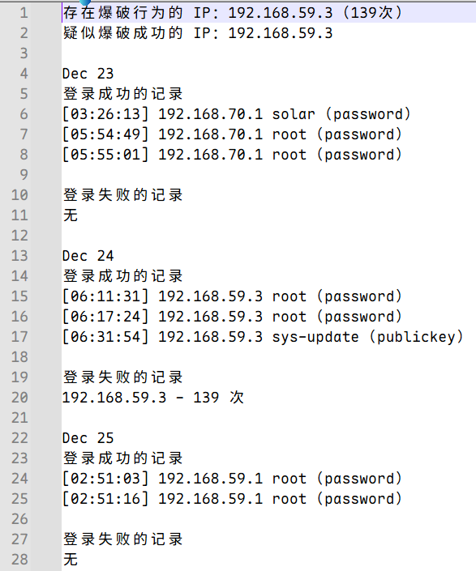
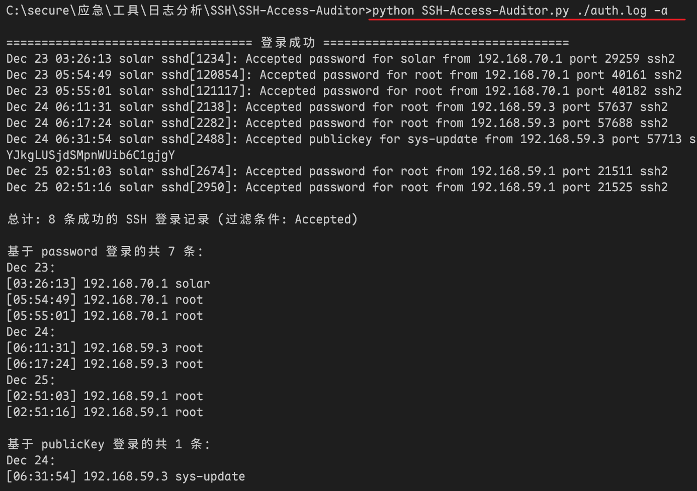
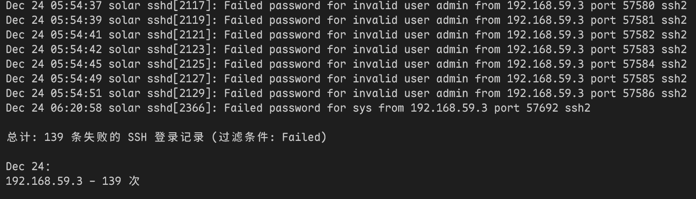
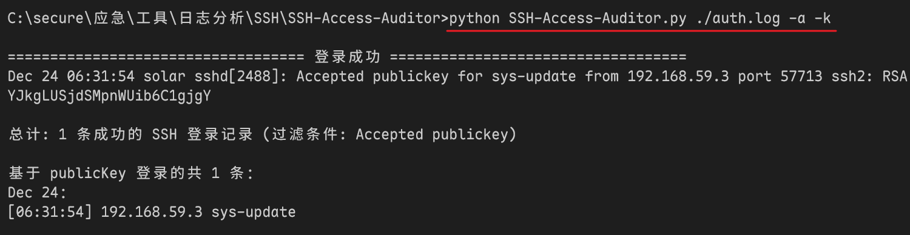

## 一、介绍

对 SSH 日志的访问登录事件进行分析。

- `/var/log/auth.log`（Debian/Ubuntu 系统）
- `/var/log/secure`（RHEL/CentOS 系统）

参考：[pizslacker/sshlog: Log-parser script for ssh-auditing - server-side tool.](https://github.com/pizslacker/sshlog)

## 二、使用方法

### 2.1 方法介绍

- `logfile`（必选）：指定要分析的日志文件路径 (例如: `./auth.log`)。
- `-h, --help`：查看帮助。
- `-a, --accepted`：在屏幕显示认证成功的登录记录及统计信息。
- `-f, --failed`：在屏幕显示认证失败的登录尝试及统计信息。
- `-k, --key`：仅在屏幕输出中过滤基于公钥 (publicKey) 的认证。
- `-p, --password`：仅在屏幕输出中过滤基于密码 (password) 的认证。
- `-P, --pam`：仅在屏幕输出中过滤基于键盘交互/PAM 的认证。
- `-t`：按指定日期筛选 (例如: `-t "12/23"`)。
- `-ts`：按起始时间筛选 (例如: `-ts "12/23 03:00:00"`)。
- `-te`：按结束时间筛选 (例如: `-te "12/23 23:00:00"`)。
- `-tr`：显示最近 X 天的记录 (例如: `-tr 7` 显示近 7 天)。
- `-o`：生成综合应急排查分析报告并输出到指定文件。

### 2.2 快速使用

- 基础分析报告：

  ```shell
  python SSH-Access-Auditor.py ./auth.log -o report.txt
  ```

  

- 筛选登录成功的记录：

  ```shell
  python SSH-Access-Auditor.py ./auth.log -a
  ```

  

- 筛选登录失败的记录：

  ```shell
  python SSH-Access-Auditor.py ./auth.log -f
  ```

  

- 筛选以 publicKey 方式登录成功的记录：

  ```shell
  python SSH-Access-Auditor.py ./auth.log -a -k
  ```

  

- 筛选特定时间段内，以 password 方式登录的尝试:

  ```shell
  python SSH-Access-Auditor.py ./auth.log -a -f -p -ts "12/24 03:00:00" -te "12/24 23:00:00"
  ```


  